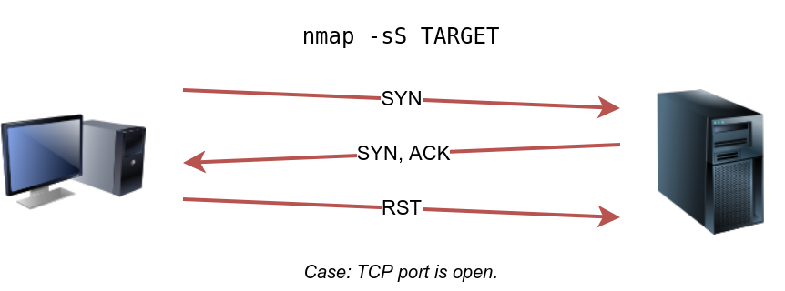
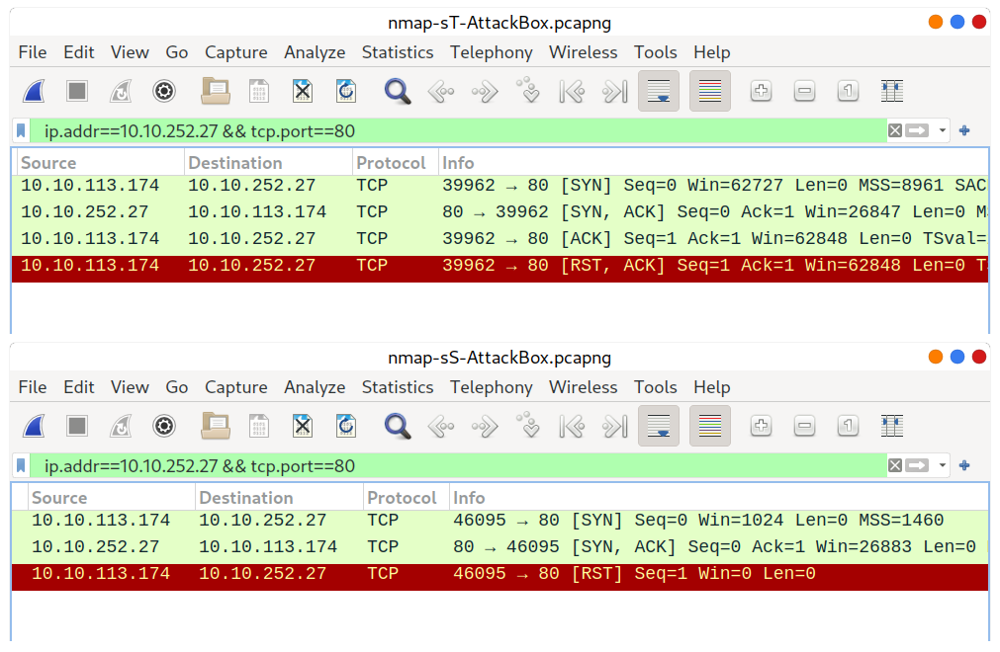
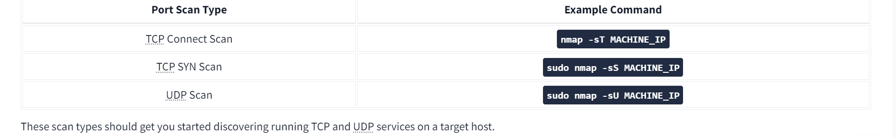
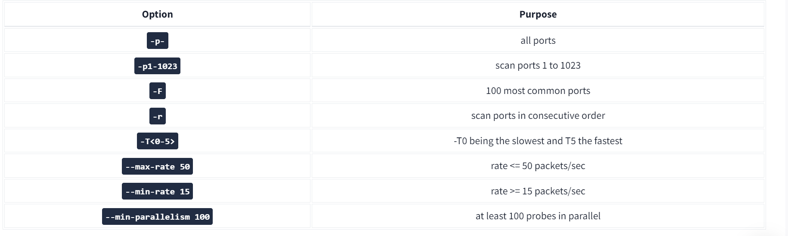
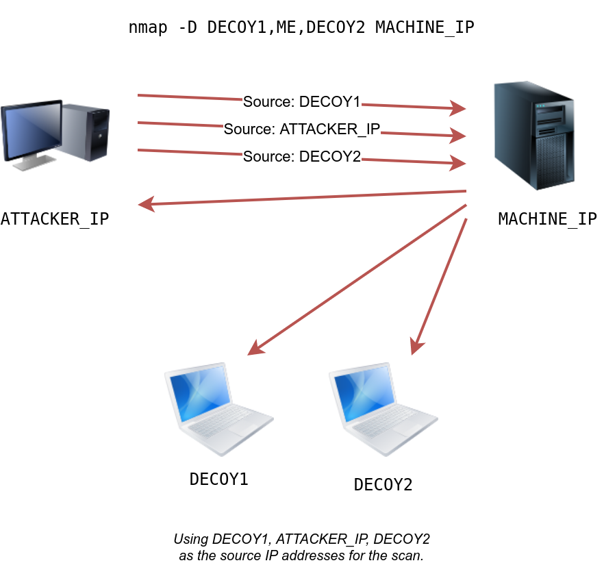

# Write_ups_THM
Repo for Write ups of THM

***

# Content
[Intro](#Intro-To-Networking)

[Nmap](#NMAP)

***
# Intro To Networking

### Ping
```bash
ping <target>
```

### TraceRoute 
It's to see the Path between you and the destination you set

```bash
traceroute Dest
```

### Whois and dig
This is a command to know about the Ip you want to
```bash
whois IP
dig Ip
```

***

# NMAP
--- 
SYN scans it to scan some targets  with synchrionization and three way handshake 

`-sS`

(RST is for anchuring the established connection , also is for error handling)

- There are a types of scan in NMAP

→ SYN `-sS` 

→TCP  `-sT` 

→UDP `-sU` 

→NULL `-sN` 

→FIN `-sF`

→Xmas `-sX`

### **1. TCP Scan**

- **Purpose**: To identify open TCP ports on a target system.
- **Features**:
    - Establishes a full TCP handshake (SYN, SYN-ACK, ACK).
    - Provides accurate results about open ports.
    - Can be used to identify services running on those ports.

### **2. UDP Scan**

- **Purpose**: To identify open UDP ports on a target system.
- **Features**:
    - Does not establish a handshake (connectionless protocol).
    - Sends UDP packets to ports and waits for a response.
    - Open ports may respond with an ICMP "Port Unreachable" message if closed.
    - Generally slower and less reliable than TCP scans due to the nature of UDP.

### **3. SYN Scan (Half-Open Scan)**

- **Purpose**: To quickly identify open ports without completing a full handshake.
- **Features**:
    - Sends SYN packets and analyzes responses (SYN-ACK for open, RST for closed).
    - Less detectable by intrusion detection systems (IDS) than full TCP scans.
    - Commonly used in tools like Nmap for stealthy scanning.

### **4. NULL Scan**

- **Purpose**: To identify open ports by sending packets with no flags set.
- **Features**:
    - If a closed port receives a NULL packet, it responds with RST; open ports do not respond.
    - Can bypass certain firewall rules that only inspect SYN packets.
    - Useful for evading detection in some scenarios.

### **5. FIN Scan**

- **Purpose**: To identify open ports by sending packets with the FIN flag set.
- **Features**:
    - Similar to NULL scans; closed ports respond with RST, while open ports may not respond.
    - Can also evade some firewall rules.
    - Less commonly used but effective against certain systems.

### **6. Xmas Scan**

- **Purpose**: To identify open ports using a packet with FIN, URG, and PUSH flags set.
- **Features**:
    - Named for the "lit" appearance of the flags (like a Christmas tree).
    - Closed ports respond with RST; open ports may not respond.
    - Effective at evading certain firewalls and IDS, but less reliable on modern systems.

---

**ICMP Network scanning**  

(Ping sweep is to test with Nmap the active hosts in the first place for knowing the structure of the network)

The Purpose of ICMP is to send packet to the Ips and see the respond who respond is the alive ip so wa can work with it . 

```bash 
nmap -sn Ip or IP range
``` 

this is where ICMP respons work and 

---

**NSE scripts** 

- Overview

it s standing from the NMAP SCRIPTS ENGINES

NSE  used to do a variety of things: from scanning for vulnerabilities, to automating exploits for them

Those are the categories of scripts of it  : 

- **`safe`**:- Won't affect the target
- **`intrusive`**:- Not safe: likely to affect the target
- **`vuln`**:- Scan for vulnerabilities
- **`exploit`**:- Attempt to exploit a vulnerability
- **`auth`**:- Attempt to bypass authentication for running services (e.g. Log into an FTP server anonymously)
- **`brute`**:- Attempt to bruteforce credentials for running services
- **`discovery`**:- Attempt to query running services for further information about the network (e.g. query an SNMP server)

- Working with NSE

If we want to work with this scripts we do 

```bash
nmap --script=name
```   

we can also make many scripts separated by comma 

```bash
nmap --script= name, name1 ....
```

if the script must input some arguments we also have `--script-args`

and inside it we made the `script.name of arg` if also have many args we separated by comma 

- Searching for the scripts

Is in the directory `/usr/share/nmap/scripts`

And this is to `install`  the scripts from the website of nmap 
””

it's also possible to install the scripts manually by downloading the script from Nmap (**`sudo wget -O /usr/share/nmap/scripts/<script-name>.nse https://svn.nmap.org/nmap/scripts/<script-name>.nse`**). This must then be followed up with **`nmap --script-updatedb`**, which updates the **`script.db`**

””

---

- **Firewall evasion**

In the default windows the ICMP are blocked so we need a way, this way is by passing with the nmap -Pn is `the pricess to scan as the host is alive and without pinging it`  

This link to see all the evasion ways to by pass the firewall using the nmap 

”https://nmap.org/book/man-bypass-firewalls-ids.html”

---

# **Nmap Basic Port Scans**

- TCP and UDP ports

In the scanning ports we find many status of the scan from nmap packets : 

| open | this mean port open and use some service  |
| --- | --- |
| close | this mean port closed and no service is here  |
| filtred | that mean the nmap can t detect if the port is accessible or not cause of the firewall |
| unfiltred  | this is where we can t know if the port is open or not even if it s accesible |
| Open|Filtered: 
 | This means that Nmap cannot determine whether the port is open or filtered. |
| 
Closed|Filtered: |  This means that Nmap cannot decide whether a port is closed or filtered |

for searching for services `/etc/services`

- TCP FLAGS

setting the flag is to make `1`

1. URG flag : if this flag is set this mean the data comming is urgent and must be done without waiting for anything else
2. ACK flag : is for seeing the acknowledgement are made
3. PSH flag : is used to tell the TCP to let the data pass to application promply
4. RST flag : is a reset connection is used when something in the destination dosen’t respond  or a firewall or things like that.
5. SYN flag : is used to initiate the TCP 3 way handshake and synchronize the sequence number with other hosts
6. FIN flag : the sender has no more data to send

- TCP connect scan

`is you're not the root or the superuser the only way to scan is with TCP !`

in the TCP hamdshake the client send SYN and server respond by ACK SYNC if not available he send RST ACK , then if the process are good , the client confirm the connection by RST ACK

`-r`  is for test the consucutive order of ports not choose it randomly 

`-F` is for test with speed decreasing the number of ports

so in this task we had see a scanning on the target IP machine and we seee just the ports

- TCP SYN scan

this mode is the default 



this is the open port case, if not the closed port 

this scan is special , what special is he s without handshake, if the client find the SYN , ACK , he send the RST



illustrate the difference

`TCP SYN is the default in nmap when we are the root user privelige`

in the scanning we see the open port and the service is IRC, internet relay chat is to , let the users join the chat rooms 

It's a protocol that allows users to join channels (chat rooms) or have one-on-one conversations.

- UDP scan

this udp is connectioneless that mean without handshake and if the port is closed and ICMP packet return unreachable .

when we sending the packet of UDP to open port we don t get back any response


this is illustration for closed port we get back the reponse 

So we made the scan to the target machine with this commadn  `nmap -sU -v -F ip`  

to made it with speed and with verbose mode.

untill now we learn how to scnan TCP and SYN ans UDP 

so we found the port and also with the service domain 

- Fine-Tuning Scope and Performance

This part is for more focus like scanning the ports that you want 

`-F for 100 port`

`--top-ports 10`  to scan the top ports to scan

`you can specify the time of scan`  with this : `T<0-5>` the fasts one is 5

- paranoid (0)
- sneaky (1)
- polite (2)
- normal (3)
- aggressive (4)
- insane (5)

Depending on what we want the timing is set, like in the CTFs we made the fasts way in some cases we made the other 

`to Control the number of packets to send`  this is the command `--min-rate number`   and `--max-rate number`

also 

we have the probes that we can control those probes are for fast scanning we can control, the same commands like the min rate max rate

SUMMARY 





So in this room we see how to scan target and we see the states of ports scan and also the possible way to made the scan

!

---

# **Nmap Advanced Port Scans**

what we will cover in this room 

- Null Scan
- FIN Scan
- Xmas Scan
- Maimon Scan
- ACK Scan
- Window Scan
- Custom Scan

---

- TCP Null Scan, FIN Scan, and Xmas Scan

→Null scan is to send TCP packets without flags and we don  t wait for response, if the ports closed we get RST ACK response.

→FIN scan this is for setting the flag FIN in flags and send it , also we don t wait for response, if is closed RST ACK is back to us.

→XMAS scan An Xmas scan sets the FIN, PSH, and URG flags simultaneously. You can select Xmas scan with the option **`-sX`**.
like the previous ones  


- **TCP maimon scan**

this scan set the FIN and ACK bits , and in the return we got the RST so we don t know if he s open or closed


- TCP ACK, Window, and Custom Scan

→TCP ACK scan 

this scan send the TCP packet with the flag ACK and we don t know the state of the port , we just got RST in response.


`-sA`

this scan is for more discover if an firewall are set or not, cause the firewall give us the state if she s set 

→Window scan 

this scan is the same as the previous but if we are behind a firewall, we got a good status responses 

`-sW`

those two previous scan can determin the firewall behavior 

→Custom scan 

This scan is for specify the flags to set, 

`nmap --scanflags SYNFIN and add more`  thenspecify the target 

in the response we don t know it  

- **Spoofing and Decoys**

In the cases of you can guarantee the response flag you can do this spoofing thing 

The spoofing here is to use IP like is you who send the packets and wait for responses so the attacker if he want to be anonymous he must you decoy , the concept of it is to send with many IP address 




we can made this spoofing with this command : 
`nmap -e INTERFACE -Pn -S Spoofed ip target ip` 

-Pn to not let the logs of ping here 

→Decoy 

in the decoy we can specify randomly Ip addresses and inside we made the Ips of decoy machines 

(decoy machines are the machines where we get the responses)

`nmap Ip,Ip,ME,IP target ip` 

- **Fragmented Packets**

→Firewall : this is for filter the packets and let them pass or block them 

→IDS : It raises an alert whenever a malicious rule is met.  he filtred the packet the data all this stuff 

→Fragmented Packets : this is useful in nmap to split the packet into pieces by this option `-f`  if you want split more 8 byte by 8 you can do it  by adding more ff or to specify you can do `--mtu`

if we want to devide TCP packet, with the option `-f` we devide the size by 8 if we have `-ff`   we devide by 16 and so one.

- Idle/Zombie Scan

In this process the attacker search for Ip and ID asking by SYN/ACK and when he got the Ips ,then he use it as he s Ip address then he send to scan the Target machine 

the command is like this  : `nmap -sI ZombieIp targetIp`  .
